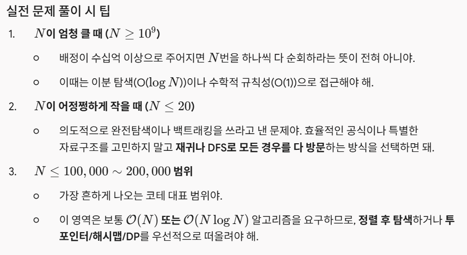

# [Lv.1] 모의고사

### 🔗 문제 링크
- [문제 출처 링크](https://school.programmers.co.kr/learn/courses/30/lessons/42840)

### 💡 문제 접근 방식
문제 설명
수포자는 수학을 포기한 사람의 준말입니다. 수포자 삼인방은 모의고사에 수학 문제를 전부 찍으려 합니다. 수포자는 1번 문제부터 마지막 문제까지 다음과 같이 찍습니다.

1번 수포자가 찍는 방식: 1, 2, 3, 4, 5, 1, 2, 3, 4, 5, ...
2번 수포자가 찍는 방식: 2, 1, 2, 3, 2, 4, 2, 5, 2, 1, 2, 3, 2, 4, 2, 5, ...
3번 수포자가 찍는 방식: 3, 3, 1, 1, 2, 2, 4, 4, 5, 5, 3, 3, 1, 1, 2, 2, 4, 4, 5, 5, ...

1번 문제부터 마지막 문제까지의 정답이 순서대로 들은 배열 answers가 주어졌을 때, 가장 많은 문제를 맞힌 사람이 누구인지 배열에 담아 return 하도록 solution 함수를 작성해주세요.

제한 조건
시험은 최대 10,000 문제로 구성되어있습니다.
문제의 정답은 1, 2, 3, 4, 5중 하나입니다.
가장 높은 점수를 받은 사람이 여럿일 경우, return하는 값을 오름차순 정렬해주세요.

- 1,2,3번 방식이 고정되어 있고 문제 수가 최대 1만개이니까 싹 다 비교해볼 수 있음

### 🛠 풀이 과정
1. 각 학생의 찍는 패턴을 배열로 만든다
2. 모든 문제를 순회하며 맞힌 답 개수를 기록한다 - i%answer1.length 나머지 연산으로 순회
3. 가장 많이 맞힌 학생들을 반환한다.

### 📚 배운 점 & 회고
데이터 개수 $N$의 크기에 따라 사용할 수 있는 완전탐색 종류가 달라짐
- N <= 10~20: O(N!) 순열 가능
- N <= 20~25: O(2^N) 부분집합, 재귀/백트래킹 가능
- N <= 500: O(N^3) 3중 for문 가능
- N <= 2000~5000: O(N^2) 2중 for문 가능
- N <= 1천만: O(N) 1중 for문 완전탐색 가능

"이거 완전탐색으로 풀어야 하나?" 판단하는 3단계 사고 과정
Step 1. 문제의 입력 크기를 먼저 본다
제한 사항(제한 조건)을 가장 먼저 확인. N이 몇 천 ~ 몇 만 단위로 꽤 작다면? ->완전탐색이나 DFS/BFS일 확률이 높음
Step 2. 규칙성이 없거나, 모든 경우의 수를 확인해야만 하는지 본다
-최댓값/최솟값을 구해야 하는데 "중간에 단정 지어서 제외할 수 있는 규칙"이 눈에 보이지 않을 때
-모든 조합이나 순서를 일일이 확인해 보기 전에는 답을 확정할 수 없을 때Step 3. 시간 복잡도를 대략 계산해 본다
내가 떠올린 완전탐색 방법의 시간 복잡도에 N을 대입했을 때 1억 번 이내라면 사용하면 됨
